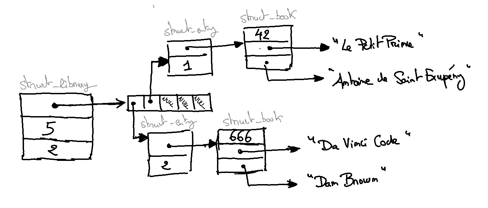

# C - Examen Machine

**Date:** 14/04/2021
**Durée:** 2h

### Documents et resources autorisés

Seuls les outils et document suivants sont autorisés : 

- votre environnement de développement C
- un terminal pour compiler/exécuter votre code
- un onglet de navigateur ouvert sur la plateforme GitLab de l'école : 
  
    http://gitlab.telecomnancy.univ-lorraine.fr/
- un onglet de navigateur ouvert sur la section 3 des *man-pages* : 
  
    https://man7.org/linux/man-pages/dir_section_3.html

**Tout autre consultation entraînera l'invalidation immédiate de l'examen et du module.**

En particulier vous **n'êtes pas autorisé accéder** au code que vous avez réalisé pour les TPs/TDs.

### Propos liminaires

L'examen sur machine se déroule comme suit :

- récupérez sur votre machine le dépôt git de l'examen (ce dépôt nommé `c2k21/lab-exam-<votre_login>` devrait être visible dans votre liste de projet sur la plateforme gitlab de l'école).
- une fois votre dépôt local instancié, vous y trouverez : le fichier `main_library.c`
- Il est **très fortement** conseillé de commiter/pousser régulièrement (a minima après chaque question) le code que vous avez produit et **de ne pas attendre la fin de la séance !**
- Ne touchez plus votre code ni aucun de vos fichiers après la fin de l'épreuve. Toute modification de fichier ou du dépôt git hors délai sera considéré comme une fraude et entrainera l'invalidation de l'examen ;
- Le dépôt sur git vaut rendu de copie. Si vous n'arrivez pas à réaliser cette étape, envoyer impérativement avant la fin de l'épreuve vos fichiers par courriel à Christophe.Bouthier@telecomnancy.eu et Gerald.Oster@telecomnancy.eu.

### Objectif

L'objectif de l'examen est d'implémenter une bibliothèque permettant de gérer une collection de livres. Les livres de la bibliothèque sont accessibles soit pas leur titre, un identifiant unique ou par leur auteur. Pour des raisons de simplification, vous ferez l'hypothèse qu'un livre n'a qu'un seul auteur et qu'il n'existe pas deux livres différents portant le même titre.

La bibliothèque permettra :

- de connaître le nombre de livres de la bibliothèque (sans tenir compte du nombre d'exemplaire)
- d'enregistrer un nouveau livre
- de savoir si un livre est disponible (en tenant compte du nombre d'exemplaires)
- de retrouver un livre à partir de son identifiant unique
- de retrouver un livre à partir de son titre
- de retrouver des livres à partir de son auteur
- d'emprunter un exemplaire d'un livre
- de retourner un exemplaire d'un livre

### Modélisation

Avant de s'attaquer à l'implémentation demandée, nous vous présentons la modélisation retenue pour la bibliothèque.

Une bibliothèque est vue comme une structure C (de type `struct _library`) mémorisant un tableau de pointeurs vers des structures représentant chaque entrée de la bibliothèque (`struct _entry`), le nombre d'entrées actuellement de bibliothèque, et la capacité maximale de la bibliothèque en nombre d'entrées.

Une entrée de la bibliothèque est une structure C mémorisant un pointeur vers une structure C représentant un livre et un entier indiquant le nombre d'exemplaires de ce livre présents dans la bibliothèque.

Un livre est un structure C (de type `struct _book`) mémorisant l'identifiant unique du livre, le titre du livre et l'auteur du livre.

### Questions

L'ordre suivant des questions est donné à titre indicatif.

#### Question 1 - La structure pour les livres

Dans un fichier `book.h` décrivez la structure C pour un livre (type `struct _book`). Cette structure mémorise l'identifiant d'un livre comme entier, le titre d'un livre et l'auteur comme deux chaînes de caractères.

Définissez un type `book` comme un alias du type `struct _book`.

#### Question 2 - les fonctions associées à la structure d'un livre

Dans un fichier `book.c` écrivez les fonctions suivantes (vous veillerez à mettre à jour en conséquence le fichier `book.h`) :

- `book *book_init(char *title, char *author)` pour créer un nouveau livre. Vous veillerez à créer des copies des chaînes de caractères passées en paramètre et à affecter un identifiant **unique** au livre. Cette fonction retourne un pointeur sur le nouveau livre.

- `void book_destroy(book *self)` pour libérer la mémoire réservée pour un livre dont le pointeur est passé en paramètre de la fonction.

- `int book_get_id(book *self)` pour obtenir l'identifiant unique du livre dont le pointeur est passé en paramètre de la fonction.

- `char *book_get_title(book *self)` pour obtenir le titre du livre dont le pointeur est passé en paramètre de la fonction.

- `char *book_get_author(book *self)` pour obtenir l'auteur unique du livre dont le pointeur est passé en paramètre de la fonction.

**Conseil :** À ce stade, vous devriez pouvoir compiler et exécuter une partie du fichier `main_library.c`. Pensez à committer et pousser ce code (les fichiers `book.h` et `book.c`).

#### Question 3 - la structure pour les entrées

Dans un fichier `library.h` décrivez la structure C pour une entrée de la bibliothèque (type `struct _entry`). Cette structure mémorise un pointeur sur un livre et un entier indiquant le nombre d'exemplaires du livre présents dans la bibliothèque.

#### Question 4 - la structure pour la bibliothèque

Dans le fichier `library.h` décrivez la structure C pour une bibliothèque (type `struct _library`). Cette structure mémorise un pointeur sur un tableau d'entrées, un entier indiquant la capacité maximale du tableau d'entrées, et un entier indiquant le nombre d'entrées présentes dans le tableau.

Définissez un type `library` comme un alias du type `struct _library`.

#### Question 5 - les premières fonctions de la bibliothèque

Dans un fichier `library.c` écrivez les fonctions suivantes (vous veillerez à mettre à jour en conséquence le fichier `library.h`) :

- `library *library_init(int initial_capacity)` pour créer une nouvelle bibliothèque. La capacité maximale est donnée en paramètre. Cette fonction retourne un pointeur sur la nouvelle bibliothèque.

- `void library_destroy(library *self)` pour libérer la mémoire réservée pour une bibliothèque dont le pointeur est passé en paramètre de la fonction.

- `int library_books_count(library *self)` pour consulter le nombre de livres enregistrés dans la bibliothèque dont le pointeur est passé en paramètre. Il s'agit bien du nombre de livres et non du nombre total d'exemplaires.

#### Question 6 - la fonction d'enregistrement d'un livre

Dans le fichier `library.c` ajouter les fonctions suivantes (vous veillerez à mettre à jour en conséquence le fichier `library.h`) :

- `void library_register_book(library *self, book *some_book)` pour enregistrer un livre dans la bibliothèque. Si une entrée existe déjà pour ce livre alors le nombre d'exemplaire de cette entrée sera incrémenté sinon une nouvelle entrée sera crée. 

**Pour des raisons de simplification, il n'est pas demandé de gérer la situation où l'on souhaite ajouter plus de livres que la capacité de la bibliothèque le permet.**

#### Question 7 - les fonctions de recherche d'un livre

Dans le fichier `library.c` ajouter les fonctions suivantes (vous veillerez à mettre à jour en conséquence le fichier `library.h`) :

- `book  *library_find_by_id(library *self, int id)` pour rechercher un livre à partir de son identifiant passé en paramètre. Cette fonction retournera le pointeur vers le livre correspondant ou le pointeur nul si aucun livre n'est trouvé.
- `book *library_find_by_title(library *self, char *title)` pour rechercher un livre à partir de son titre passé en paramètre. Cette fonction retournera le pointeur vers le livre correspondant ou le pointeur nul si aucun livre n'est trouvé.
- `int library_is_book_available(library *self, char *title)` pour connaître le nombre d'exemplaires d'un livre disponible dans la bibliothèque. Cette fonction retournera le nombre d'exemplaires disponibles ou 0 si aucun livre n'est trouvé (ou aucun exemplaire n'est disponible).

**Conseil :** À ce stade, vous devriez pouvoir compiler et exécuter une large partie du fichier `main_library.c`. Pensez à committer et pousser ce code (les fichiers `book.h` et `book.c`) si vous ne l'avez pas encore fait.

#### Question 8 - les fonctions d'emprunt et de retour d'un livre

Dans le fichier `library.c` ajouter les fonctions suivantes (vous veillerez à mettre à jour en conséquence le fichier `library.h`) :

- `book *library_borrow_book(library *self, char *title)` pour emprunter le livre dont le titre est passé en paramètre. Cette fonction retourne un pointeur sur le livre en question si un exemplaire est disponible (le nombre d'exemplaire sera donc mis à jour) ou le pointeur nul si le livre n'a pas été trouvé ou qu'aucun exemplaire n'est disponible.
- `int library_return_book(library *self, book *some_book)` pour retourner un livre emprunté. La fonction retournera le nombre d'exemplaires du livre à nouveau disponibles, 0 si le livre n'existe pas dans la bibliothèque.

**Conseil :** À ce stade, vous devriez pouvoir compiler et exécuter une large partie du fichier `main_library.c`. Pensez à committer et pousser ce code (les fichiers `book.h` et `book.c`) si vous ne l'avez pas encore fait.

#### Question 9 - la fonction de recherche de livres à partir de son auteur

Dans le fichier `library.c` ajouter la fonction suivante (vous veillerez à mettre à jour en conséquence le fichier `library.h`) :

- `book **library_find_by_author(library *self, char *author)` pour rechercher les livres d'un auteur enregistré dans la bibliothèque. Cette fonction retournera un tableau de pointeurs vers les livres de l'auteur passé en paramètre.
  
  **Nous vous demandons de retourner un tableau dont la taille est égale au nombre de livres de l'auteur.**

  Il est possible que vous ayez besoin d'utiliser la fonction de la librairie C `realloc(...)`. Nous vous invitons à consulter sa documentation si vous ne connaissez pas cette fonction. https://man7.org/linux/man-pages/man3/realloc.3.html (ou utiliser la commande `man 3 realloc` sous un système *nix)

#### Question 10 - la réponse D

Bravo ! vous avez terminé votre épreuve.
Vérifiez que vous avez bien committé et déposé votre code sur la plateforme de l'école :

- [ ] le fichier `book.h` est déposé
- [ ] le fichier `book.c` est déposé
- [ ] le fichier `library.h` est déposé
- [ ] le fichier `library.c` est déposé
- [ ] tous ces fichiers compilent
- [ ] le fichier `main_library.c` compile et s'exécute correctement
- [ ] il n'y a pas de fuites mémoires

